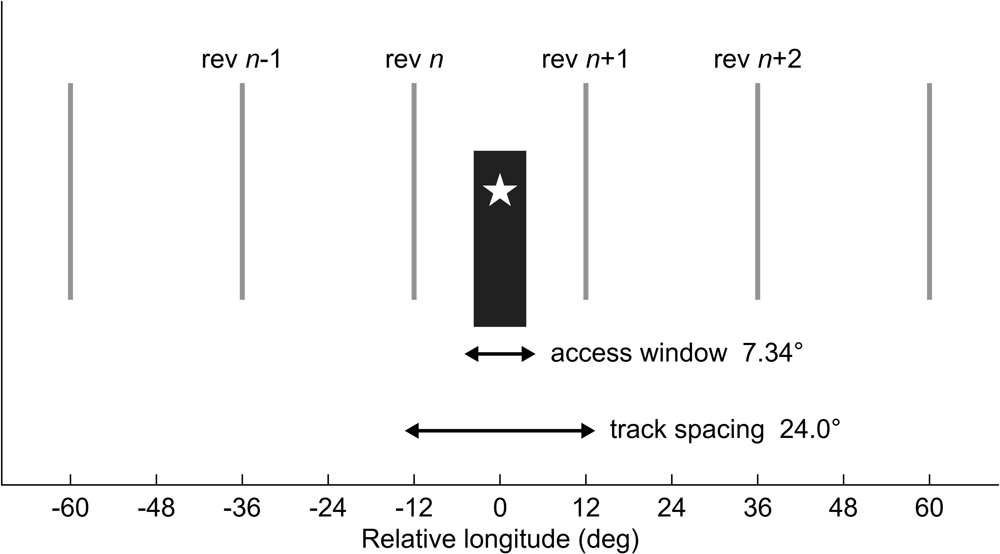
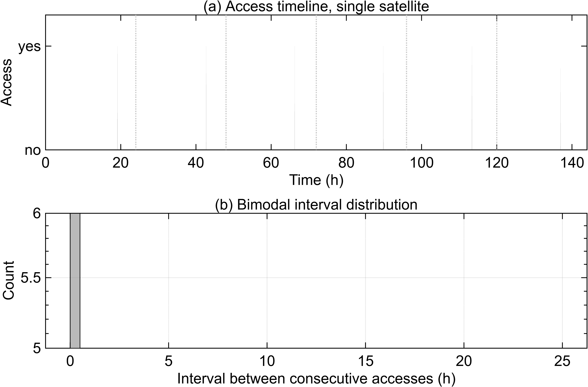
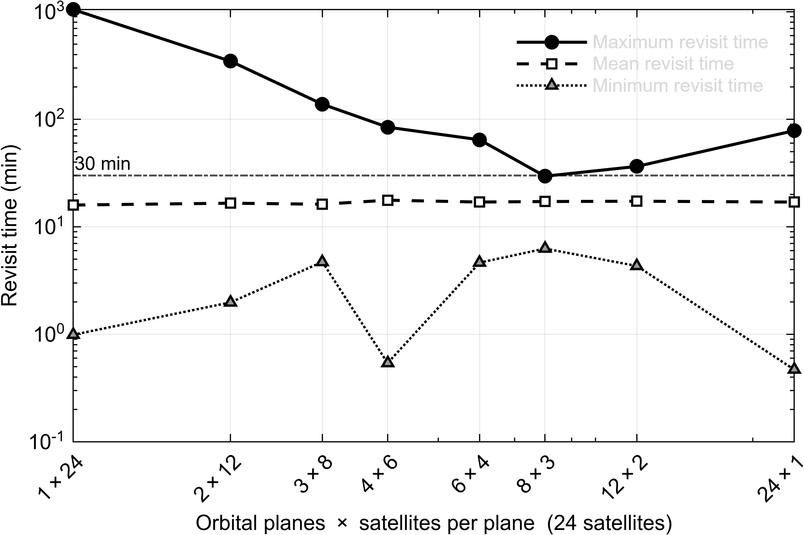
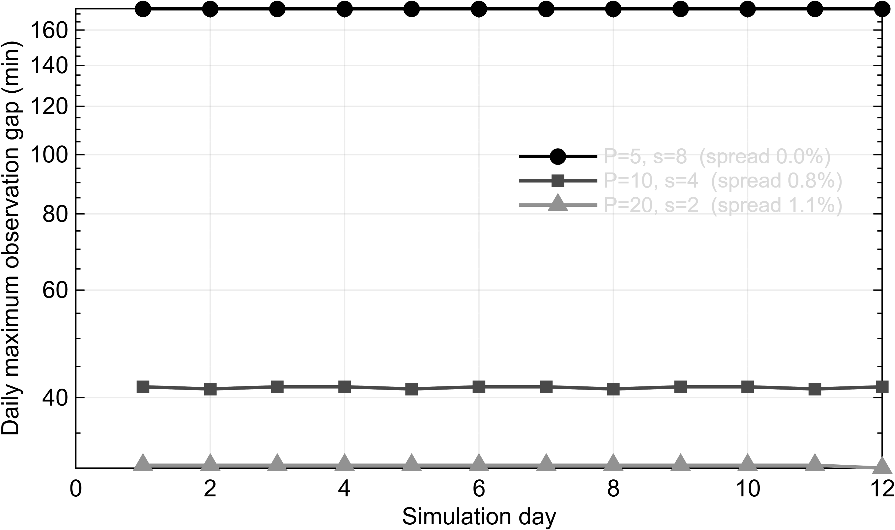
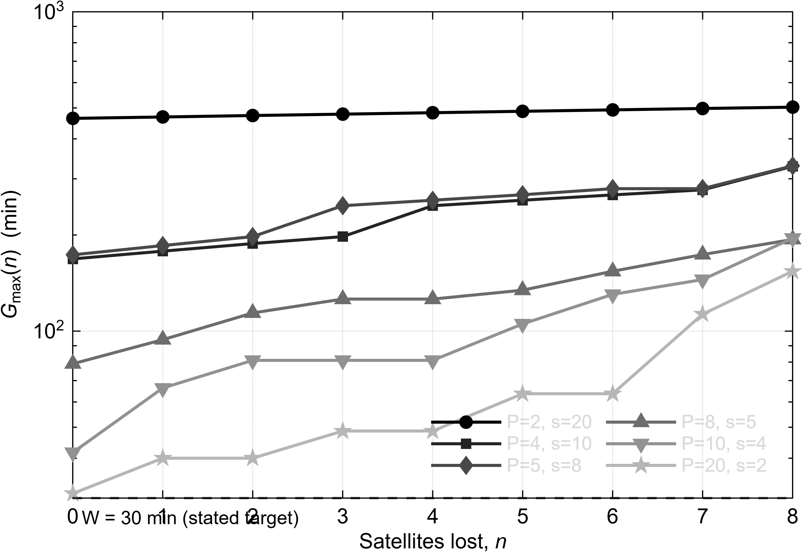
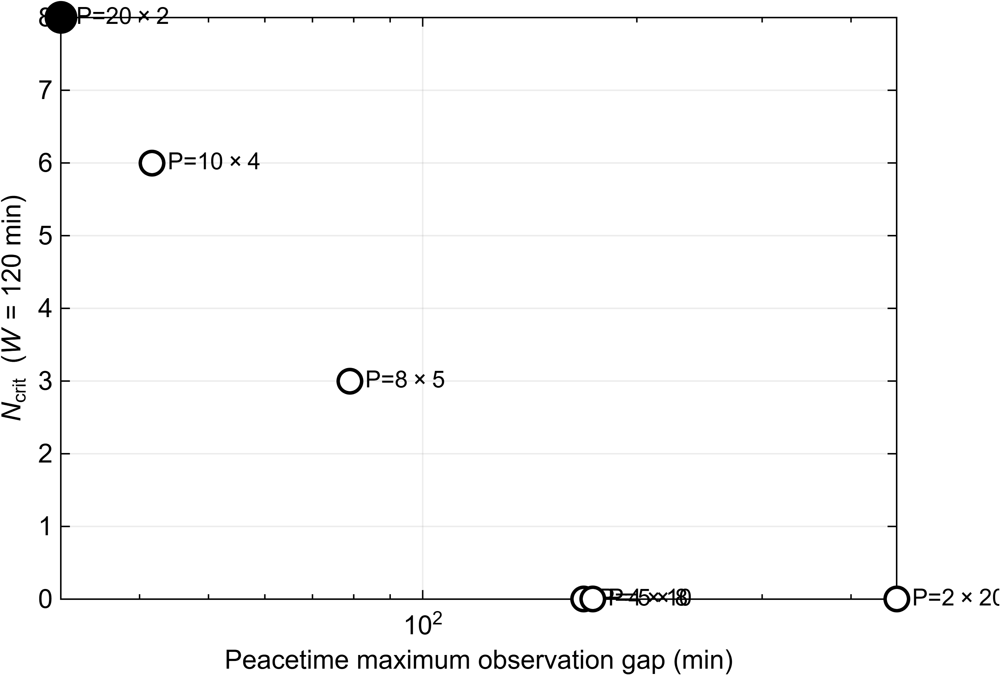

# LEO Constellation Coverage Analysis
 
Coverage-gap analysis of low-Earth-orbit SAR satellite constellations, including
degradation under adversarial node loss.
 
MATLAB. No toolboxes required.
 
---
 
## Why
 
Constellation design for regional surveillance is usually evaluated by **average
revisit time (ART)**. That metric turns out to be almost blind to how satellites
are distributed among orbital planes.
 
For a fixed constellation size, changing the plane allocation moves ART by a few
percent while the **maximum observation gap** moves by more than an order of
magnitude. A design chosen on ART alone therefore leaves the worst case
uncontrolled — and the worst case is where a time-critical surveillance mission
actually fails.
 
This repository computes both metrics, and adds the case the design literature
does not usually treat: what happens to the gap when satellites are lost.
 
---
 
## What it does
 
- Walker-Delta constellation generation with J2 secular propagation of RAAN and
  argument of latitude
- Access determination against multiple ground targets under SAR incidence-angle
  constraints, with selectable look direction
- Observation-gap statistics, and an exact (non-Monte-Carlo) expression for the
  probability that a randomly placed mission window sees no access
- Degradation under a **greedy optimal adversary** that removes, at each step,
  the satellite maximising the resulting worst-case gap
- Parameter sweeps over plane allocation, and a Pareto view of peacetime
  performance against wartime tolerance
---
 
## Baseline
 
| Parameter | Value |
|---|---|
| Satellites | 40 |
| Altitude | 490 km (γ = 15/1 repeat ground track) |
| Inclination | 43° |
| SAR incidence angle | 15–35° |
| Targets | 9 area targets, 38–41° N |
| Propagation | J2 secular |
| Duration / step | 12 days / 20 s |
 
---
 
## Results
 
### The geometry that produces the gap
 
At 490 km with a 15–35° incidence band, the ground access annulus is 121–313 km,
about ±3.67° of longitude at 40° N. Successive ground tracks are 24.0° apart —
exactly 360°/15, as the repeat condition requires.
 
The spacing is 3.3× the window, so **a satellite cannot reach the target on every
revolution**.
 

 
A single satellite therefore reaches the target once per day, in a pass lasting
tens of seconds, followed by a gap of about 23.5 hours. The interval
distribution is strictly bimodal: no intermediate value occurs.
 

 
### Mean revisit time does not see the plane allocation
 
Across plane allocations of the same 40 satellites:
 
| Planes × sats/plane | ART (min) | Max gap (min) |
|---|---|---|
| 2 × 20 | 14.85 | 463.7 |
| 4 × 10 | 14.99 | 168.3 |
| 5 × 8 | 14.93 | 173.3 |
| 8 × 5 | 15.31 | 79.0 |
| 10 × 4 | 14.92 | 41.7 |
| 20 × 2 | 15.29 | 31.0 |
 
**ART varies by 3%. The maximum gap varies by a factor of 15.**
 
The same pattern appears in published work: Cho & Cho (2020) report, for 24
satellites, a mean of 15.9–17.7 min against a maximum of 29.6–1049.3 min.
 

 
### The gap is a schedule, not a tail
 
Daily maximum gaps are essentially constant over the simulation — spread of 0.1%
or less for four of the six configurations. The gap recurs at the same time each
day and is computable from orbital elements.
 

 
### Degradation under node loss
 

 
Growth of the maximum gap as satellites are removed by a greedy optimal
adversary. Note that the two-plane configuration barely degrades — not because
it is robust, but because its gap is already so large that further loss adds
little.
 
Defining **N_crit** as the number of losses needed to push the gap past a
mission window W:
 
| Planes | W=30 | W=45 | W=60 | W=90 | W=120 |
|---|---|---|---|---|---|
| 2 | 0 | 0 | 0 | 0 | 0 |
| 4 | 0 | 0 | 0 | 0 | 0 |
| 5 | 0 | 0 | 0 | 0 | 0 |
| 8 | 0 | 0 | 0 | 1 | 3 |
| 10 | 0 | 1 | 1 | 5 | 6 |
| 20 | 0 | 3 | 5 | 7 | 8 |
 
At W = 30 min every allocation gives N_crit = 0: the gap already exceeds the
window before any loss. Differences between allocations appear only for longer
windows, where distributing satellites across more planes raises the number of
losses the constellation can absorb — **without adding a single satellite**.
 

 
---
 
## Cross-validation
 
The model was independently reimplemented in Python and the two implementations
agree to the reported precision:
 
| Quantity | Python | MATLAB |
|---|---|---|
| Revolutions per nodal day | 15.0015 | 15.0015 |
| Ground-track spacing | 24.000° | 23.998° |
| ART / max gap, 2 planes | 14.85 / 463.7 | 14.85 / 463.7 |
| ART / max gap, 20 planes | 15.29 / 31.0 | 15.29 / 31.0 |
| Daily spread | 0.0–1.1% | 0.0–1.1% |
 
The repeat-orbit check is a useful internal test: 15.0015 revolutions per nodal
day confirms that the baseline satisfies γ = 15/1, and the ground-track spacing
then follows as 360°/15 by definition.
 
One subtlety worth recording. Ground-track spacing must be referenced to the
**nodal** period and the **nodal** day. Using the Keplerian period against the
sidereal day omits J2 nodal regression and gives 23.67°, which is inconsistent
with the repeat condition the orbit satisfies.
 
Full console output: [`results/run_log.txt`](results/run_log.txt)
 
---
 
## Usage
 
```matlab
>> run_simulation     % several minutes; writes results.mat
>> make_figures       % writes fig1.png ... fig7.png at 600 dpi
```
 
All settings are in `kmw_config.m`. Nothing else needs editing.
 
| File | Role |
|---|---|
| `kmw_config.m` | Baseline parameters |
| `kmw_accessmask.m` | Constellation generation, propagation, access |
| `kmw_gaps.m` | Gap statistics and window-failure probability |
| `kmw_maxgap.m` | Maximum gap only; used inside the greedy search |
| `run_simulation.m` | Computes everything, saves `results.mat` |
| `make_figures.m` | Draws and exports the figures |
 
---
 
## Limitations
 
- **J2 secular only.** Higher-order gravity, drag, and solar radiation pressure
  are not modelled. Published work using a high-precision propagator reports
  substantially worse maximum revisit times than a J2 model for the same
  constellation, so the values here are optimistic.
- **Geometry only.** Payload duty cycle, power and thermal limits, tasking, and
  downlink are outside the model. Not every access can be used, so the computed
  gaps are a lower bound.
- **Look direction is a modelling choice.** A SAR images one side of the ground
  track per pass. This assumption alone changes the maximum gap considerably,
  and much of the published literature does not state it. The setting is
  explicit in `kmw_config.m`.
- **Hard loss only.** Jamming, dazzling, and attacks on the ground segment
  produce the same mission effect without any geometric degradation, and require
  a different framework.
---
 
## Notes
 
Target coordinates in `kmw_config.m` are user-supplied; the values provided are
illustrative. Replace them with your own area of interest.
 
This code is the computational basis for a paper on surveillance-gap
vulnerability in regional SAR constellations. Reference to be added on
publication.
